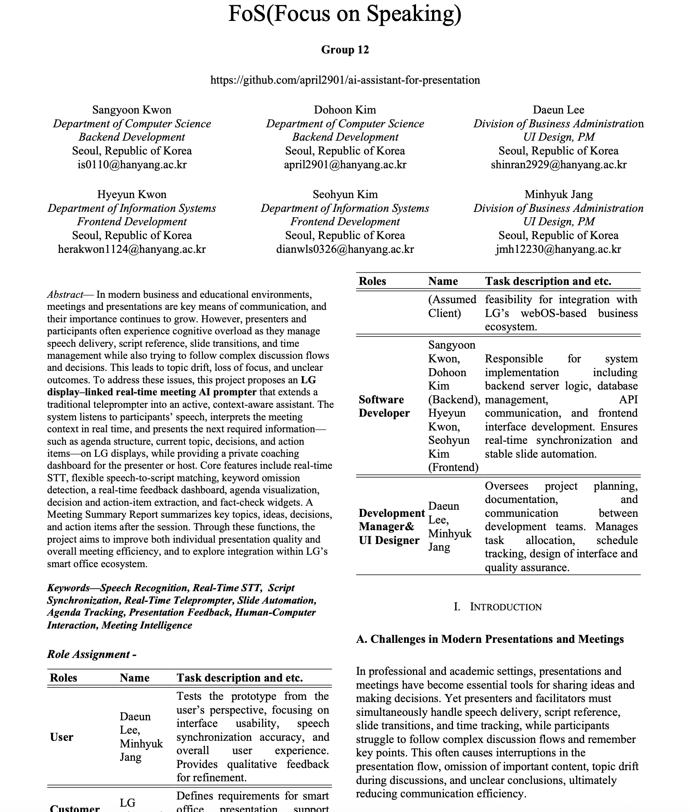

# FoS (Focus on Speaking)

This is a real-time AI prompter project designed to work with LG displays.  
It supports the entire presentation and meeting flow (before, during, and after) as a real-time teleprompter and meeting assistant.

The live service is deployed on Vercel:  
https://focusonspeaking.vercel.app/

## 1. Project Overview

- **Real-time teleprompter** based on STT (Speech-to-Text)
- Script–speech synchronization with flexible matching (KoSentence-BERT + LLM)
- Keyword omission detection and real-time script completion suggestions
- Presenter dashboard (speed, progress, basic emotion/attention estimation)
- **Agenda Map**(Meeting mode):
  - Real-time intent tagging of utterances (idea, decision, action item, question, etc.)
  - Agenda map visualization the main topic of each meeting.
  - Decision / Action Item widget
  - Fact-check widget (RAG / web search based)

For detailed requirements and system design, see the IEEE-style paper:  
`docs/fos_paper.tex`.

## 2. Tech Stack

## 3. Repository Structure

Please refer to `structure.md` for the full repository layout:  
[structure.md](docs/structure.md)

## 4. Paper

[Project overview PDF](docs/SE_Assignment2_G12.pdf)  

